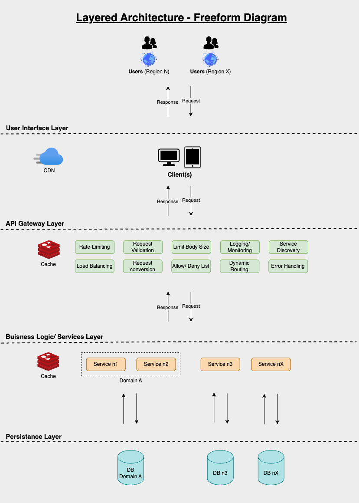
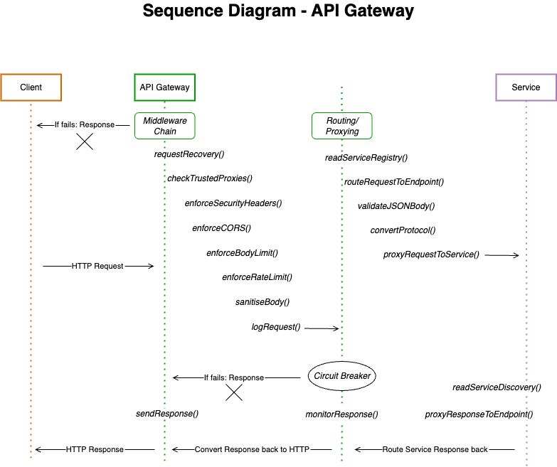
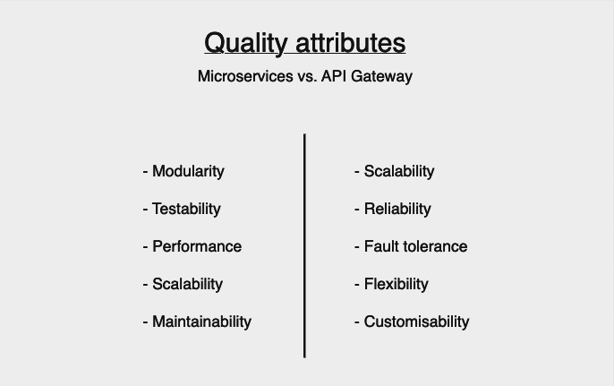
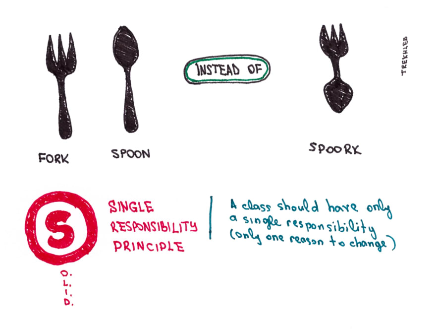
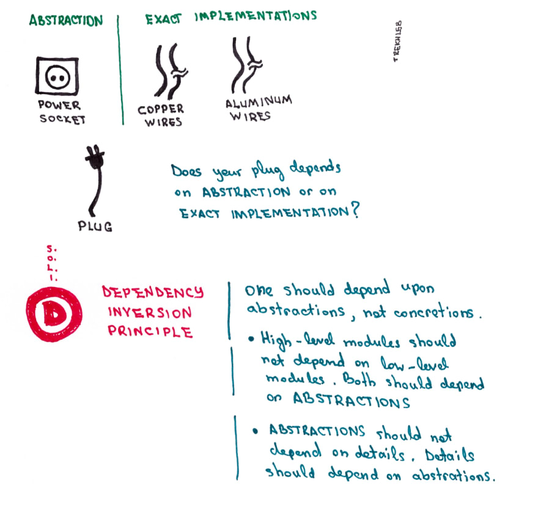

# API Gateway Documentation

## Introduction

Created a new API gateway that is easier to use and customise without the overhead of a vast and hard-to-use gateway. Introduce to content

## What is an API Gateway?

An API Gateway is a single entry point for clients, acting like a reverse proxy for managing and routing requests, making it especially useful for microservice architectures.
The gateway layer can handle typical tasks that would otherwise be governed by each service individually so the services can concentrate on one domain-specific task. This central layer between the client and the services allows monitoring, caching, analytics, and request conversion.

To identify what services, the API gateway accesses a service registry to look up registered services. The Gateway is, therefore, entirely decoupled from the services.
That makes the Circuit breaker pattern an essential tool where a certain amount of services can fail or retry before a request fails.

Generally, there are fewer requests due to the orchestration of an API Gateway, although it adds another hop in the network.

### Why is an API Gateway necessary?

The adoption of the microservice pattern introduced new challenges for clients. With services being dynamically redeployed several times daily, a mechanism was needed to route the request to the right services. All services have to handle tasks like rate-limiting and other common things to check the request, which is not part of the domain of service due to the single responsibility principle.
Here is where an API Gateway can come in and handle the addressed issues. As the single entry point, the API gateway is aware of its registered services and can perform the expected task formerly performed by the services. In that way, the services can focus on the domain logic and get uniform and safe requests through that single entry point, the API Gateway.

### Example setup of an API Gateway

In the following diagram, you can see how and where an API Gateway fits into your architecture:

The API Gateway receives the request from the client, performs some action on it, and then routes the request to the receiving service. The diagram makes the central point and tasks that can be performed more evident.
Another use case is a Backends for Frontends approach. In this case, each client has its own Gateway, as the name suggests. So if there are three clients, mobile, web and native, each would have its entry point into the system through its own Gateway.

### Common tasks of an API Gateway

The idea of two possible architecture setups leads nicely into what exactly an API Gateway does internally; as mentioned before, an API Gateway is mainly responsible for routing or proxying responses which come in. But the central point where all requests flow through allows for more actions we can perform on that layer. The following section will introduce some shared tasks an API Gateway could have on top of what has been mentioned. Just note that the API gateway does not have to perform all the following functions:

- Rate Limiting (Could be service specific)
- Enforce Security headers
- Sanitisation
- Body Size Limiting (could also be fine-grained to each service)
- CORS policy
- Logging/ Monitoring
- Load balancing (although not a typical task of an API gateway, it is a great place to perform that task due to the service orchestrating nature)
- Request conversion (standard HTTP coming from the client, but gRPC or GraphQL is used by the server)
- Dynamic Routing
- Request validation (JSON body undergoes validation, or individual headers have to be present)
- Allow/deny requests
- Authorisation/ Authentication
- Caching (saving even more requests comes with the complexity of handling complexities with caches)

A possible flow of tasks can be seen in the following diagram:

### Design Patterns and Quality Attributes of an API Gateway

The overall pattern making API Gateways exist is the microservice pattern. In this pattern, one structures the application in a set of independently deployable, loosely coupled components called services.

The API gateway is a design that solves the problems introduced by microservices.
One is the Circuit breaker pattern, which comes from electrical engineering and refers to a set of switches, and when a threshold of these switches fails, the whole operation down the line also fails. In the API gateway, this pattern is used to ensure, even when retrying, that further requests down the line are not even executed to save resources.

Another essential pattern for API gateways is the Server-side discovery pattern, which essentially allows the Gateway to know about the services underneath through a Service Registry. Our browser daily uses a use case for that pattern, DNS, which lists IP addresses and their domains.  
A more structural pattern necessary for an API Gateway is the Proxy pattern. It allows the Gateway to perform something before or after the request gets to the services/client. An example would be the attached middleware chain, shown in graphics 1 and 2.  
The middleware chain by itself is a pattern. It is called the Chain of Responsibility and it is a creational pattern. Each handler decides to process the request or pass it to the next handler in the chain.

A pattern that uses the API Gateway pattern is the earlier mentioned Backends for Frontends pattern. It is a specific use case for applying an API Gateway in practice. Each client has its entry point into the application architecture, allowing client-specific setups.

Microservices and API gateways solving different tasks also come with varying quality attributes. Whereas an API Gateway needs to scale well and be reliable, Microservices are very modular and focused on performance and maintainability.

## About the Capstone API Gateway

The Capstone API Gateway is a choice if you want an easy-to-use and customisable API Gateway. Unlike other products, the idea of this project is to be set up quickly and without much configuration (although if you want, you can!).

- <b>Configurability:</b> The Capstone API Gateway is highly customisable. Whatever you want to change, you can.

- <b>Rapid Deployment:</b> With a boilerplate tailored to your needs, you will quickly get ready to deploy your architecture and can focus on building your business logic.

- <b>Declarative YAML Config:</b> Your services are being registered via a YAML configuration. Most of what you need you can configure here.

### Codebase Patterns

#### Project Structure

This API Gateway codebase is designed with a separation of concerns in mind, aiming to make the codebase more maintainable and scalable. The main folders are `configs`, `controllers`, `database`, `interfaces`, `middlewares`, `routes`, `services`, and `utils`. The flow of a request through the application would be as follows:

The idea originates from the CLEAN Architecture by Robert C. Martin (Uncle Bob). On his website and in the book, he uses the following diagram to illustrate the architecture (Clean Coder Blog, 2023):

Clean Coder Blog. (2023). Cleancoder.com. https://blog.cleancoder.com/uncle-bob/2012/08/13/the-clean-architecture.html

Our interpretation of the architecture and the actual CLEAN architecture booth aim to achieve separation of concerns. Secondly, it must be loosely coupled because the API Gateway operates in a Microservice environment. The low coupling of the API Gateway to the services allows for simplified isolation, understanding, and testing of individual components. It keeps the API gateway separate from the Services so each is individually deployable.

#### SOLID Principles

This codebase tries to adhere to the SOLID principles and invites all maintainers and users to do so. Also, change it if you spot places where this could be improved. Especially the Single Responsibility Principle (SRP) and the Dependency Inversion principle (DIP) should be applied, and others can be discarded if these two are present.

A great Blog about SOLID on dev.to (Oleksii Trekhleb, 2020) has some easy-to-understand graphics introducing the two ideas, the first one being the SRP:

The second important principle we invite you to apply is the DIP:

Images coming from: Oleksii Trekhleb. (2020, March 29). S.O.L.I.D. Principles Around You. DEV Community; DEV Community. https://dev.to/trekhleb/s-o-l-i-d-principles-around-you-1o17

Even though this is a Golang codebase and not necessarily strict Object Oriented Programming, the principles help to create cleaner and more maintainable code.

## How to use this API Gateway

Pull the repo and go through the process of creating the API Gateway server and use it as is (full-fledged option).

The way to register services resides in the `endpoints.yaml`, where you will find a possible setup of services. Just update that file with your configuration and services, and when starting the server, the configuration will be loaded and applied.

Your services will have to be available on the specified endpoints in the `endpoints.yaml`.

    cd location_of_pulled_repo

    go run cmd/capstone_gateway/main.go

Happy API Gatewaying!

## Refrences

Clean Coder Blog. (2023). Cleancoder.com. https://blog.cleancoder.com/uncle-bob/2012/08/13/the-clean-architecture.html

Oleksii Trekhleb. (2020, March 29). S.O.L.I.D. Principles Around You. DEV Community; DEV Community. https://dev.to/trekhleb/s-o-l-i-d-principles-around-you-1o17
